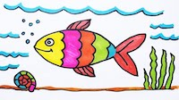

# Memfish



**Memfish provides you a way to store values against the key for a short period of time**
(20 mins by default)

Memfish stands for `memory of a fish`. There is a theory that fish has a short memory span, around
3 seconds. However, [recent research](https://www.telegraph.co.uk/news/science/science-news/4158477/Fishs-memories-last-for-months-say-scientists.html) shows that potentially that's not true and fish can be trained
to remember for up to 5 months.

That justifies us calling this library `Memfish` and relate to a fish
which is training the memory and remembers things for 20 mins.

## Installation

The package can be installed by adding `memfish` to your list of dependencies in `mix.exs`:

```elixir
def deps do
  [
    {:memfish, "~> 0.1.0"}
  ]
end
```

To start `memfish` process before your application add to your `mix.exs`

```elixir
def application do
  [
    extra_applications: [:memfish]
  ]
end
```

The docs can be found at [https://hexdocs.pm/memfish](https://hexdocs.pm/memfish).

## Usecase

We use this library to provide an ability to remember jwt tokens for a short period of time and
forget them once they have been used or expired.
